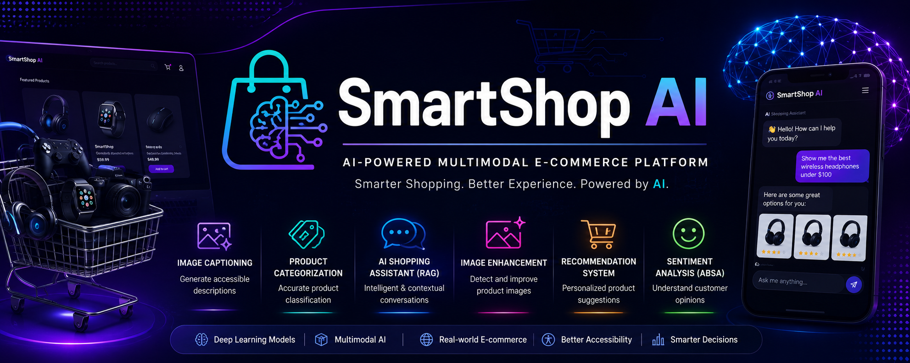
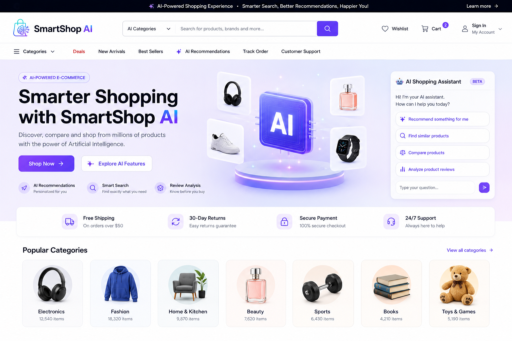
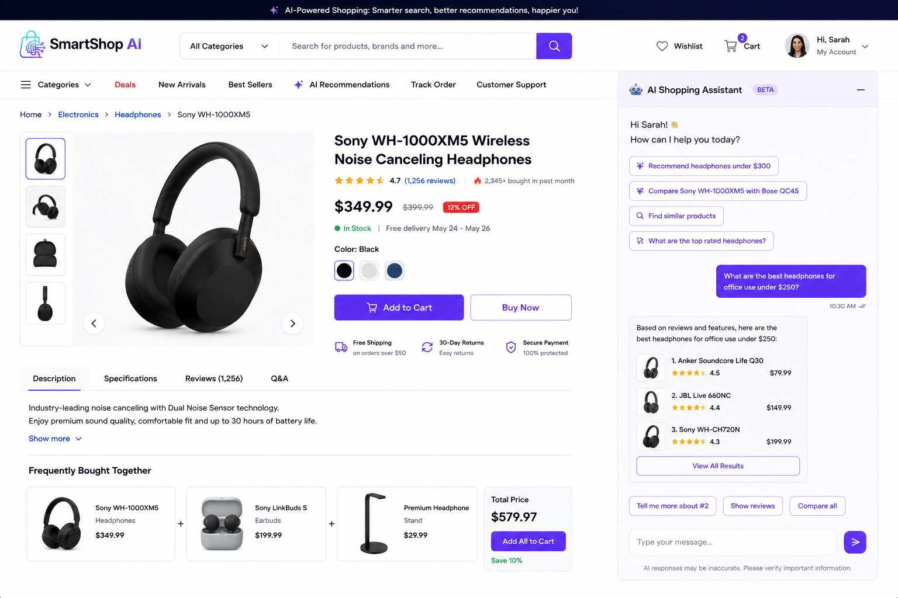
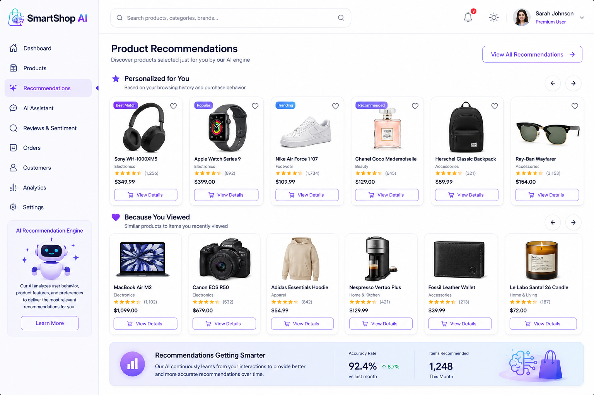
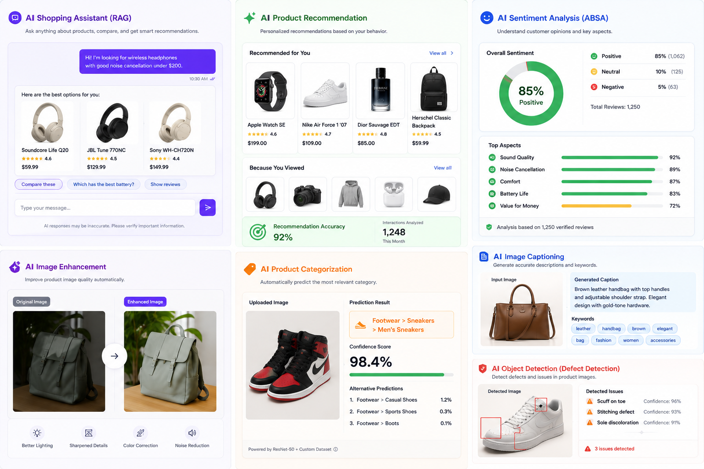
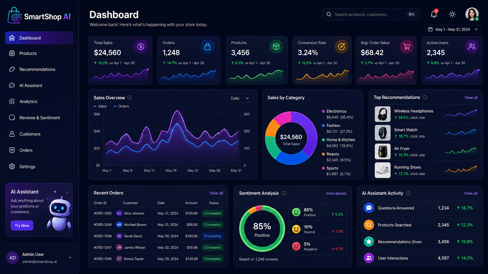
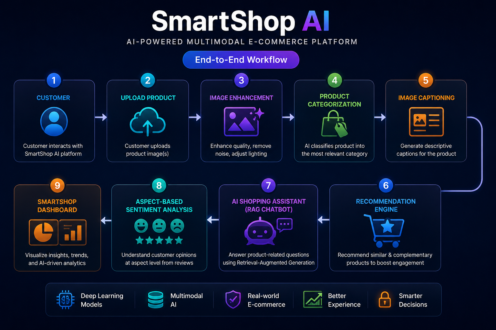
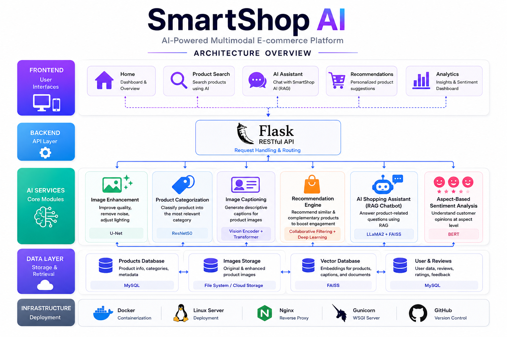
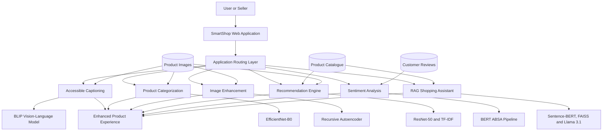
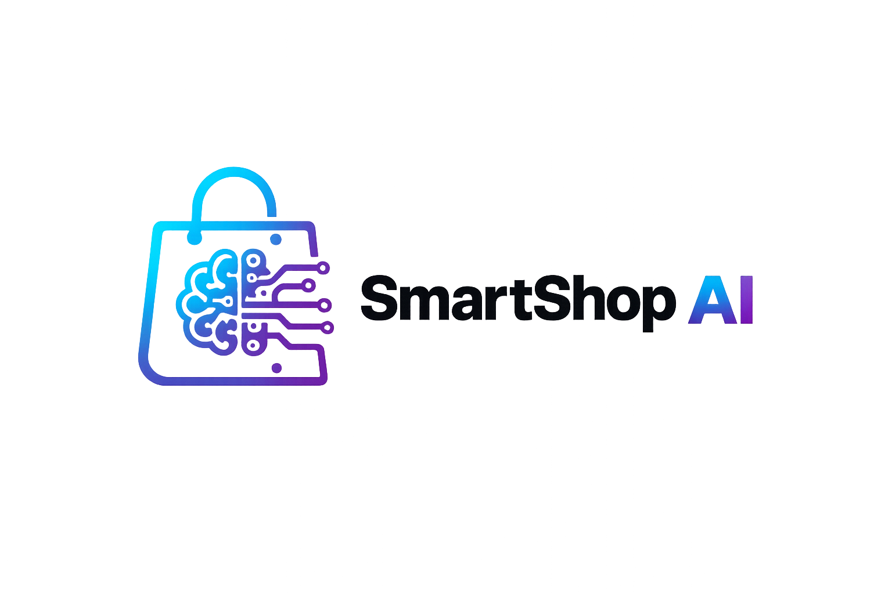

<div align="center">



<br>

# SmartShop AI

### AI-Powered Multimodal E-Commerce Platform

**Computer Vision · Deep Learning · Multimodal Retrieval · NLP · RAG · Recommendation Systems**

<br>

[](#technology-stack)
[](#technology-stack)
[](#technology-stack)
[](#rag-shopping-assistant)
[](#rag-shopping-assistant)
[](#ai-modules)
[](#accessible-product-captioning)
[](#project-context)

<br>

**An intelligent e-commerce experience combining image understanding, product recommendation, image restoration, product classification, review analysis and contextual AI assistance.**

</div>

---

## Table of Contents

- [Overview](#overview)
- [Project Motivation](#project-motivation)
- [Business Objectives](#business-objectives)
- [Platform Showcase](#platform-showcase)
- [End-to-End Workflow](#end-to-end-workflow)
- [Global Architecture](#global-architecture)
- [AI Modules](#ai-modules)
  - [Accessible Product Captioning](#accessible-product-captioning)
  - [Image Enhancement](#image-enhancement)
  - [Multimodal Recommendation](#multimodal-recommendation)
  - [Automatic Product Categorization](#automatic-product-categorization)
  - [Aspect-Based Sentiment Analysis](#aspect-based-sentiment-analysis)
  - [RAG Shopping Assistant](#rag-shopping-assistant)
- [Models and Techniques](#models-and-techniques)
- [Results and Performance](#results-and-performance)
- [Repository Structure](#repository-structure)
- [Installation](#installation)
- [Running the Application](#running-the-application)

- [Team](#team)
- [Project Context](#project-context)
- [Limitations](#limitations)
- [Future Improvements](#future-improvements)
- [Responsible Use](#responsible-use)
- [Acknowledgements](#acknowledgements)

---

## Overview

**SmartShop AI** is a multimodal intelligent e-commerce platform designed to improve both the seller and customer experience through Deep Learning and Artificial Intelligence.

The platform combines six complementary AI modules:

1. Accessible product-description generation
2. Product-image enhancement
3. Multimodal product recommendation
4. Automatic product categorization
5. Aspect-Based Sentiment Analysis
6. Retrieval-Augmented Generation shopping assistant

Instead of treating each AI task as an isolated experiment, SmartShop AI integrates them into a unified e-commerce workflow.

```text
Product Image
     │
     ├── Image Enhancement
     ├── Accessible Captioning
     ├── Product Categorization
     └── Visual Embedding
              │
              ▼
     Multimodal Recommendation
              │
              ▼
        Product Catalogue
              │
      ┌───────┴────────┐
      ▼                ▼
Customer Reviews   Product Knowledge
      │                │
      ▼                ▼
     ABSA          RAG Assistant
      │                │
      └───────┬────────┘
              ▼
    Intelligent Shopping Experience
```

---

## Project Motivation

Modern e-commerce platforms face several recurring challenges.

### Product descriptions

Product listings may contain:

- missing descriptions;
- vague or incomplete descriptions;
- inaccessible visual information;
- inconsistent product attributes.

### Product images

Uploaded images may contain:

- blur;
- poor lighting;
- visual noise;
- aliasing;
- insufficient detail.

### Product discovery

Traditional search and recommendation systems may struggle to combine:

- visual similarity;
- textual metadata;
- product attributes;
- customer preferences.

### Customer reviews

Review scores alone do not explain which product characteristics customers appreciate or dislike.

### Shopping assistance

Users often need contextual answers based on real catalogue data rather than generic chatbot responses.

SmartShop AI addresses these challenges through a unified, multimodal and user-centred platform.

---

## Business Objectives

The platform was designed around six business objectives.

| Objective | AI Capability | Expected Value |
|---|---|---|
| Accessible descriptions | Image captioning | Improve product information and accessibility |
| Better product images | Image enhancement | Improve catalogue visual quality |
| Smarter discovery | Multimodal recommendation | Suggest visually and semantically similar products |
| Automated catalogue organization | Product classification | Reduce manual categorization effort |
| Customer-opinion understanding | ABSA | Extract product-specific strengths and weaknesses |
| Contextual assistance | RAG chatbot | Answer questions using real catalogue information |

---

## Platform Showcase

> **Portfolio visualization notice:** the interface visuals below are polished concept mockups created to illustrate the implemented SmartShop AI capabilities. The models, modules, architecture and reported metrics are based on the academic project and its official presentation.

---

### SmartShop AI Homepage

<p align="center">
  
</p>

The homepage presents SmartShop AI as a customer-facing e-commerce website with:

- AI-powered search;
- product categories;
- personalized recommendations;
- review analysis;
- an integrated shopping assistant;
- product-discovery shortcuts.

---

### Intelligent Product Page

<p align="center">
  
</p>

The intelligent product page combines several AI outputs in one experience:

- generated product caption;
- predicted category;
- classification confidence;
- original and enhanced image comparison;
- detected product attributes;
- review sentiment;
- aspect-level opinion analysis;
- similar product recommendations.

---

### AI Shopping Assistant

<p align="center">
  
</p>

The assistant supports product-centred interactions such as:

- finding products under a specific budget;
- comparing products;
- retrieving similar products;
- explaining customer reviews;
- answering catalogue questions;
- generating contextual product recommendations.

---

### Product Recommendation Experience

<p align="center">
  
</p>

The recommendation module presents products based on multimodal similarity, including visual characteristics and textual metadata.

---

### AI Feature Gallery

<p align="center">
  
</p>

This gallery summarizes the complete SmartShop AI intelligence layer:

- RAG shopping assistant;
- multimodal recommendation;
- Aspect-Based Sentiment Analysis;
- image enhancement;
- product categorization;
- accessible image captioning;
- image-quality analysis.

---

### Analytics Dashboard Concept

<p align="center">
  
</p>

The dashboard illustrates how AI outputs may be consolidated into a business-oriented interface containing recommendations, customer sentiment and assistant activity.

---

## End-to-End Workflow

<p align="center">
  
</p>

The workflow follows both the seller and customer journey.

### Seller flow

```text
Seller uploads product image
          │
          ▼
Image-quality evaluation
          │
          ▼
Image enhancement
          │
          ▼
Accessible caption generation
          │
          ▼
Automatic categorization
          │
          ▼
Product added to catalogue
```

### Customer flow

```text
Customer browses catalogue
          │
          ▼
Multimodal recommendations
          │
          ▼
RAG shopping assistance
          │
          ▼
Review and sentiment analysis
          │
          ▼
Better-informed purchase decision
```

---

## Global Architecture

<p align="center">
  
</p>

The repository is structured as a modular Python web application in which each AI capability exposes its own model and route layer.



---

## AI Modules

## Accessible Product Captioning

The accessible-captioning module generates descriptive product text directly from images.

### Problem

Product images are not always accompanied by accurate textual descriptions. This reduces:

- product discoverability;
- catalogue consistency;
- accessibility for visually impaired users;
- search quality.

### Reference architecture

The project studied the **Show, Attend and Tell** architecture:

```text
Image
  │
  ▼
CNN Encoder
  │
  ▼
Visual Attention
  │
  ▼
LSTM Decoder
  │
  ▼
Generated Caption
```

### SmartShop AI improvement

The project proposes a more modern vision-language architecture:

```text
Product Image
      │
      ▼
BLIP Vision Transformer Encoder
      │
      ▼
Multi-Head Cross-Attention
      │
      ▼
Transformer Decoder
      │
      ▼
Beam Search
      │
      ▼
WCAG-Oriented Post-Processing
      │
      ▼
Accessible Product Caption
```

### Main components

| Component | Purpose |
|---|---|
| BLIP | Pre-trained vision-language representation |
| Vision Transformer | Extract visual product features |
| Cross-attention | Align image regions and generated text |
| Transformer decoder | Generate sequential descriptions |
| Beam search | Select coherent caption candidates |
| WCAG post-processing | Improve accessibility-oriented language |

### Repository files

```text
alt_text/
├── model.py
├── routes.py
└── __init__.py
```

### Output

The module produces:

- product description;
- accessible alternative text;
- visual keywords;
- catalogue-enrichment information.

### Reported metric

| Metric | Result |
|---|---:|
| BLEU-4 | **0.0894** |

---

## Image Enhancement

The image-enhancement module detects and improves low-quality product images.

### Target problems

- blur;
- poor lighting;
- noise;
- aliasing;
- loss of visual detail.

### Architecture

The project uses a recursive deep autoencoder.

```text
Degraded Product Image
          │
          ▼
Multi-Level Encoder
          │
          ▼
Compressed Bottleneck
          │
          ▼
Symmetric Decoder
          │
          ▼
Residual Reconstruction
          │
          ▼
Anti-Aliasing Filter
          │
          ▼
Enhanced Product Image
```

The architecture progressively reduces the feature-map dimensions before reconstructing the image through upsampling and residual blocks.

### Objectives

- restore sharper details;
- reduce aliasing;
- improve lighting;
- reduce noise;
- preserve relevant product information.

### Repository files

```text
defect_detection/
├── enhancer.py
├── model.py
├── modelold.py
├── modelpaper.py
├── routes.py
├── train_enhancer.py
├── enhancer.pth
├── enhancer_v2.pth
├── enhancer_paper.pth
├── enhancer_paper (2).pth
└── __init__.py
```

### Trained artifacts

The repository contains several model versions, demonstrating iterative experimentation and model comparison.

### Reported metric

| Metric | Result |
|---|---:|
| PSNR | **21.57 dB** |

---

## Multimodal Recommendation

The recommendation module combines image information with textual product metadata.

### Input modalities

#### Visual information

- product image;
- visual shape;
- texture;
- colour;
- design characteristics.

#### Textual information

- product name;
- category;
- attributes;
- description;
- available metadata.

### Architecture

```text
Product Image
      │
      ▼
ResNet-50 Encoder
      │
      ▼
Visual Embedding
      │
      ┐
      │
      ├── Multimodal Fusion ──► Unified Product Embedding
      │
      ┘
Product Metadata
      │
      ▼
Text Cleaning
      │
      ▼
TF-IDF Vectorization
      │
      ▼
Text Embedding
```

The final similarity engine compares the query product with catalogue products using cosine similarity.

### Main techniques

| Technique | Role |
|---|---|
| ResNet-50 | Extract visual embeddings |
| TF-IDF | Encode product metadata |
| Feature normalization | Create comparable embeddings |
| Late fusion | Combine visual and textual similarity |
| Cosine similarity | Rank related products |

### Repository files

```text
recommendations/
├── engine.py
├── routes.py
└── __init__.py
```

### Output

- top-k similar products;
- visual similarity score;
- textual similarity score;
- fused recommendation score.

### Reported metric

| Metric | Result |
|---|---:|
| Top similarity score | **0.70** |

---

## Automatic Product Categorization

The categorization module automatically predicts the most relevant product category from an uploaded image.

### Architecture

The project uses a fine-tuned **EfficientNet-B0** model.

```text
224 × 224 Product Image
          │
          ▼
EfficientNet-B0 Backbone
          │
          ▼
Feature Vector
          │
          ▼
Custom Classification Head
          │
          ▼
15 E-Commerce Categories
```

### Training strategy

The training process is divided into two phases.

#### Phase 1 — Warm-up

- backbone frozen;
- custom classification head trained;
- higher learning rate;
- rapid adaptation to the target dataset.

#### Phase 2 — Fine-tuning

- selected backbone layers unfrozen;
- lower learning rate;
- discriminative learning rates;
- early stopping;
- regularization and augmentation.

### Regularization and augmentation

- MixUp;
- label smoothing;
- weighted sampling;
- gradient clipping;
- learning-rate scheduling;
- early stopping;
- image transformations;
- random erasing;
- colour jitter;
- perspective transformations.

### Repository files

```text
categorization/
├── model.py
├── product_categorizer_v3.pth
├── routes.py
└── __init__.py
```

### Reported metric

| Metric | Result |
|---|---:|
| Accuracy | **0.86** |

---

## Aspect-Based Sentiment Analysis

The sentiment module goes beyond classifying a complete review as positive or negative.

It identifies specific product aspects and determines the sentiment associated with each aspect.

### Example

```text
"The screen is great, but the camera is disappointing
and the battery does not last."
```

Expected structured output:

| Aspect | Sentiment |
|---|---|
| Screen | Positive |
| Camera | Negative |
| Battery | Negative |

### Two-stage architecture

#### Stage 1 — Aspect extraction

A BERT token-classification model identifies product aspects with BIO tags.

```text
B-ASP → Beginning of an aspect
I-ASP → Inside an aspect
O     → Outside an aspect
```

#### Stage 2 — Sentiment classification

A BERT sequence-classification model predicts:

- positive;
- neutral;
- negative.

### Architecture

```text
Customer Review
      │
      ▼
BERT Token Classification
      │
      ▼
Detected Aspects
      │
      ▼
BERT Sequence Classification
      │
      ▼
Aspect-Level Sentiment
```

### Repository files

```text
sentiment/
├── inference.py
├── routes.py
└── __init__.py
```

### Reported metrics

| Metric | Result |
|---|---:|
| F1 score | **0.76** |
| Macro F1 | **0.815** |

---

## RAG Shopping Assistant

The SmartShop AI chatbot uses Retrieval-Augmented Generation to answer questions from real product-catalogue information.

### Why RAG?

A general-purpose language model may generate answers that are:

- generic;
- outdated;
- unsupported;
- inconsistent with the current product catalogue.

The RAG architecture grounds responses in retrieved product data.

### Pipeline

```text
User Question
      │
      ▼
Sentence-BERT Embedding
      │
      ▼
FAISS Vector Search
      │
      ▼
Top-K Relevant Products
      │
      ▼
Enriched Product Context
      │
      ▼
Llama 3.1 8B through Groq
      │
      ▼
Contextual Response
```

### Technologies

| Component | Technology |
|---|---|
| Query embeddings | Sentence-BERT |
| Vector search | FAISS |
| Retrieval | Top-k semantic search |
| Language model | Llama 3.1 8B |
| Inference provider | Groq |
| Knowledge source | Product catalogue |

### Advantages

- contextual answers;
- reduced hallucinations;
- catalogue-grounded responses;
- product comparisons;
- product discovery;
- more precise shopping assistance.

### Repository files

```text
chatbot/
├── model.py
├── routes.py
└── __init__.py
```

### Reported metric

| Metric | Result |
|---|---:|
| Retrieval hit rate | **0.917** |

---

## Models and Techniques

| Module | Model or Technique |
|---|---|
| Captioning | BLIP, Vision Transformer, cross-attention, Transformer decoder |
| Enhancement | Recursive deep autoencoder, residual reconstruction |
| Recommendation | ResNet-50, TF-IDF, multimodal late fusion, cosine similarity |
| Categorization | EfficientNet-B0 fine-tuning |
| ABSA | BERT token classification and BERT sequence classification |
| Chatbot | Sentence-BERT, FAISS, Llama 3.1 8B, Groq |
| Accessibility | WCAG-oriented caption post-processing |
| Image preprocessing | Resizing, normalization, augmentation |
| Product retrieval | Semantic vector search |
| Application data | JSON catalogue and modular Python routes |

---

## Results and Performance

The official project presentation reports the following module-level results.

| AI Module | Primary Metric | Result |
|---|---|---:|
| Accessible caption generation | BLEU-4 | **0.0894** |
| Image enhancement | PSNR | **21.57 dB** |
| Multimodal recommendation | Top similarity | **0.70** |
| Product categorization | Accuracy | **0.86** |
| Aspect extraction and sentiment | F1 | **0.76** |
| Aspect-Based Sentiment Analysis | Macro F1 | **0.815** |
| RAG chatbot | Retrieval hit rate | **0.917** |

### Result interpretation

#### Captioning

The captioning module generates coherent and contextual product descriptions while supporting accessibility-oriented post-processing.

#### Enhancement

The PSNR result indicates measurable reconstruction quality for restored product images.

#### Recommendation

The multimodal engine identifies visually and semantically related products.

#### Classification

The categorization model achieves an accuracy of 86% across the defined e-commerce categories.

#### Sentiment analysis

The ABSA pipeline identifies product aspects and associates them with contextual customer sentiment.

#### RAG chatbot

The retrieval hit rate demonstrates strong catalogue-retrieval performance for product-oriented questions.

> These results were measured during the academic project and depend on the corresponding datasets, experimental configuration and evaluation protocol.

---

## Repository Structure

```text
smartshop-ai/
│
├── alt_text/
│   ├── model.py
│   ├── routes.py
│   └── __init__.py
│
├── categorization/
│   ├── model.py
│   ├── product_categorizer_v3.pth
│   ├── routes.py
│   └── __init__.py
│
├── chatbot/
│   ├── model.py
│   ├── routes.py
│   └── __init__.py
│
├── defect_detection/
│   ├── enhancer.py
│   ├── model.py
│   ├── modelold.py
│   ├── modelpaper.py
│   ├── routes.py
│   ├── train_enhancer.py
│   ├── enhancer.pth
│   ├── enhancer_v2.pth
│   ├── enhancer_paper.pth
│   ├── enhancer_paper (2).pth
│   └── __init__.py
│
├── recommendations/
│   ├── engine.py
│   ├── routes.py
│   └── __init__.py
│
├── sentiment/
│   ├── inference.py
│   ├── routes.py
│   └── __init__.py
│
├── static/
│   ├── index.html
│   └── images/
│       ├── gamepad.jpg
│       ├── gaming_headset.jpg
│       ├── graphics_tablet.png
│       ├── prod_001.jpg
│       ├── prod_002.jpg
│       ├── prod_003.jpg
│       ├── razer_mouse.jpg
│       └── smart_watch.webp
│
├── assets/
│   ├── aiassistant.png
│   ├── allfonctiions.png
│   ├── architecture.png
│   ├── banner.png
│   ├── dashboard.png
│   ├── home.png
│   ├── logo.png
│   ├── logo.svg
│   ├── produit.png
│   ├── recomm.png
│   └── workflow.png
│
├── .env.example
├── .gitattributes
├── .gitignore
├── app.py
├── database.py
├── products.json
├── requirements.txt
└── README.md
```

---

## Installation

### Prerequisites

Install:

- Python 3.10 or later;
- Git;
- a virtual-environment tool;
- sufficient storage for the included model weights.

### Clone the repository

```bash
git clone https://github.com/sarah-falehh/smartshop-ai.git
cd smartshop-ai
```

### Create a virtual environment

```bash
python -m venv .venv
```

### Activate on Windows

```powershell
.venv\Scripts\activate
```

### Activate on Linux or macOS

```bash
source .venv/bin/activate
```

### Install dependencies

```bash
python -m pip install --upgrade pip
pip install -r requirements.txt
```

### Configure environment variables

Copy the example environment file.

#### Windows PowerShell

```powershell
Copy-Item .env.example .env
```

#### Linux or macOS

```bash
cp .env.example .env
```

Open `.env` and provide the required values.

Do not commit real secrets or API keys.

---

## Running the Application

Start the application from the repository root:

```bash
python app.py
```

The terminal should display the local application address.

Open the displayed URL in your browser.

### Main modules

The application routes are organized by capability:

```text
alt_text/routes.py
categorization/routes.py
chatbot/routes.py
defect_detection/routes.py
recommendations/routes.py
sentiment/routes.py
```

---

## Project Demonstration


## Team

SmartShop AI was developed by a six-member engineering team.

| Team Member |
|---|
| Wala Eddine Ghazouani |
| Bahaeddine Amara |
| Amen Allah Ben Aissa |
| Hassan Zorkot |
| Ali Zouaoui |
| Sarah Faleh |

The project combined work across:

- Deep Learning;
- Computer Vision;
- Natural Language Processing;
- recommendation systems;
- multimodal retrieval;
- RAG;
- web application integration;
- experimentation;
- technical documentation;
- presentation and demonstration.

---

## Project Context

SmartShop AI is an academic Deep Learning project focused on the design of an intelligent, multimodal and accessible e-commerce platform.

The project demonstrates how multiple specialized AI models can be integrated into one coherent product experience.

### Main domains

- Computer Vision
- Vision-Language Models
- Transformers
- Natural Language Processing
- Multimodal Retrieval
- Recommendation Systems
- Large Language Models
- Accessibility
- E-Commerce AI

---

## Limitations

- The repository is an academic prototype.
- Some model artifacts require significant memory and storage.
- Results depend on the original datasets and evaluation conditions.
- The generated captions may occasionally omit product details.
- The recommendation engine is limited by catalogue diversity.
- The chatbot depends on the quality of retrieved context.
- Product categorization is limited to the categories used during training.
- Sentiment models may struggle with sarcasm, mixed sentiment and implicit opinions.
- The generated interface visuals in `assets/` are portfolio mockups and not screenshots of every implemented application screen.
- Production deployment would require stronger authentication, monitoring, testing and security controls.

---

## Future Improvements

### Captioning

- train on a larger e-commerce caption dataset;
- evaluate additional vision-language models;
- improve multilingual caption generation;
- add attribute-aware caption control;
- automate WCAG quality checks.

### Image enhancement

- compare the recursive autoencoder with U-Net and diffusion-based restoration;
- add perceptual loss;
- add real-time quality scoring;
- improve high-resolution reconstruction.

### Recommendation

- incorporate user interaction history;
- add collaborative filtering;
- evaluate contrastive multimodal embeddings;
- add diversity and novelty constraints;
- support session-based recommendations.

### Categorization

- expand the number of product categories;
- support hierarchical classification;
- add explainability through Grad-CAM;
- improve class-imbalance handling.

### Sentiment analysis

- support multilingual reviews;
- detect implicit aspects;
- add opinion summarization;
- handle mixed and comparative sentiment.

### RAG assistant

- add conversation memory;
- add source citations;
- support hybrid semantic and keyword search;
- evaluate larger product catalogues;
- add reranking;
- implement automated retrieval evaluation.

### Engineering

- add automated tests;
- add Docker support;
- add continuous integration;
- add model versioning;
- add API documentation;
- add experiment tracking;
- add production monitoring.

---

## Responsible Use

SmartShop AI should be used for:

- education;
- research;
- prototyping;
- Deep Learning experimentation;
- portfolio demonstration;
- accessibility exploration;
- e-commerce AI evaluation.

Generated content and recommendations should be verified before being used in a production catalogue.

The system should not automatically publish product claims, prices or safety information without human validation.

---

## Acknowledgements

SmartShop AI was developed as a collaborative academic project by a multidisciplinary engineering team.

The project builds upon concepts from:

- *Show, Attend and Tell*;
- BLIP;
- Vision Transformers;
- EfficientNet;
- ResNet;
- BERT;
- Sentence-BERT;
- FAISS;
- Llama;
- Retrieval-Augmented Generation;
- WCAG accessibility guidelines.

Special thanks to all team members for their contributions to the modelling, experimentation, integration, documentation and demonstration of the platform.

---

<div align="center">



<br>

### Smarter Shopping. Better Accessibility. Powered by AI.

</div>
